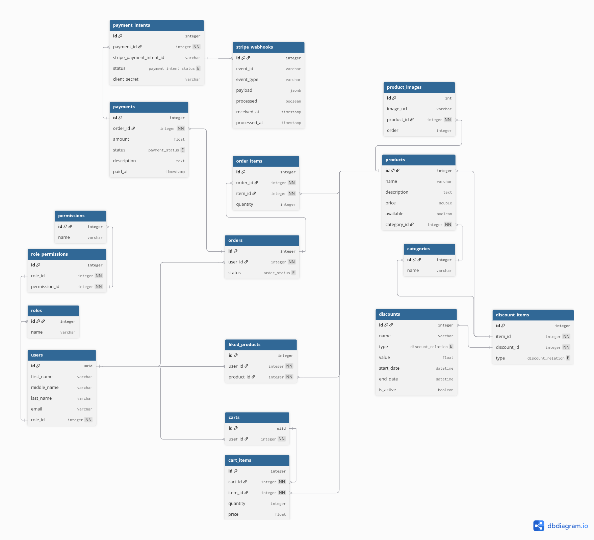

# Module 4 – REST API Project 🏗️

REST API developed using **Spring Boot** and follows a layered architecture. The project is currently **under construction**, and some components may change during development 👷🏾‍♂️🚧.

---

## 📁 Project Structure

```
.
├── docs
│   ├── api_documentation.yml
│   ├── ERD.png
│   └── graphql # (schemas, queries & mutations)
│       ├── auth
│       ├── commerce
│       ├── common
│       ├── delivery
│       ├── payments
│       └── schema.graphqls
├── HELP.md
├── mvnw
├── mvnw.cmd
├── pom.xml
├── README.md
├── src
│   ├── main
│   └── test
└── target
```

The most relevant files at this stage are located in the `docs` folder.

---

## 🧩 Entity Relationship Diagram (ERD)

The following diagram represents the current database design of the system:



---

## 📘 API Documentation

The REST API endpoints are documented using **OpenAPI / Swagger**.

### SwaggerHub

You can view the endpoints here:

👉 https://app.swaggerhub.com/apis/test-476-472/module-4_api-rest/1.0.0

The OpenAPI definition is also included in the project `docs/api_documentation.yml`

## 🛜 GraphQL Documentation

The `graphqls` files contains schemas, mutations, and queries adapted to the project domain, organized by domain packages.
